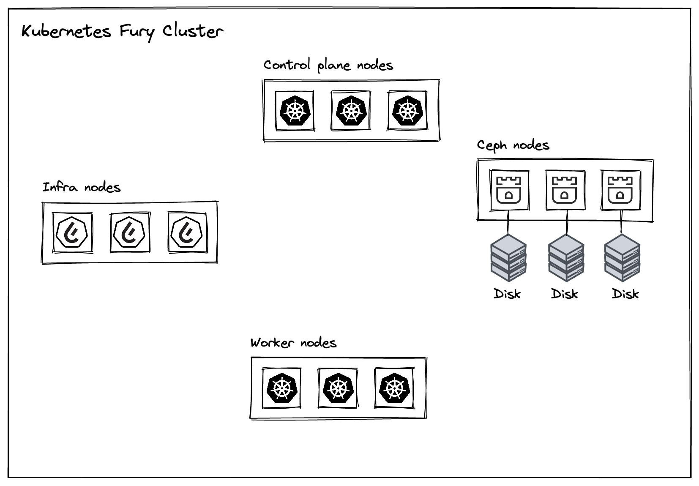

# Rook Host Cluster

<!-- <KFD-DOCS> -->

Rook Host Cluster deploys a Ceph [host storage cluster](https://rook.io/docs/rook/v1.10/CRDs/Cluster/host-cluster/) using Rook CRs as defined by [Rook Operator](../rook-operator).

The reference architecture implemented by this module is one with a dedicated node pool with directly attached storage provisioned by a human operator, as summarised in the following diagram:


> ⚠️ **WARNING**
> Most probably, you don't want to use this package *as-is* but you want to choose in which nodes the Ceph cluster will be deployed. Head over to the [example](../../examples/rook-hostcluster-nodeSelector/) that shows how to do that.

## Requirements

- Kubernetes >= `1.19.0`
- Kustomize = `v3.5.3`
- [rook-operator](../rook-operator)
- [prometheus-operator](https://github.com/sighupio/fury-kubernetes-monitoring/tree/main/katalog/prometheus-operator)
- Empty raw disks attached to Ceph nodes

## Image repository and tag

* Ceph image: `registry.sighup.io/fury/ceph/ceph:v17.2.`

## Configuration
This package deploys Ceph with the following configuration
- 2 MGRs
- 3 MONs and OSDs
- RBD pool with replication enabled
- CephFS filesystem with replication enabled and hot standby on metadata pool

## Deployment

You can deploy Rook Host Cluster by running the following command:

```shell
kustomize build | kubectl apply -f -
```

<!-- </KFD-DOCS> -->

## License

For license details please see [LICENSE](../../LICENSE)
